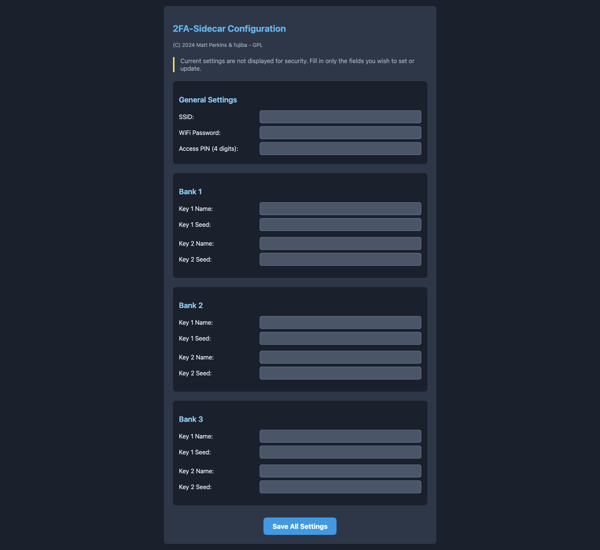

# 2FA Sidecar

Matt Perkins & fujiba - Copyright (C) 2024-2025
Spawned out of the need to often type a lot of two factor authentication
but still have some security while remaining mostly isolated from the host system.
See github for 3D models and wiring diagram.

## About

The 2FA Sidecar is a small external keyboard-like device with five or two keys specifically designed for generating and sending time-based two-factor authentication (2FA) codes with a single key press. It is primarily designed to be compatible with Google's 2FA implementation known as Time-Based One-Time Password (TOTP), which is specified in RFC 6238.

The purpose of the 2FA Sidecar is to simplify the process of using 2FA codes when switching between different security levels in various parts of a network. Instead of having to manually open your phone, retrieve the code, and type it in, the sidecar device allows you to generate and send the code with just a single key press.

The device supports up to 3 banks of 5 different TOTP codes (for a total of 15), allowing you to manage a large number of 2FA-enabled accounts. You can switch between banks using dedicated buttons. Additionally, it features a TFT screen on the front where you can read the generated code if you prefer to type it manually.

The 2FA Sidecar is compatible with any platform that supports USB HID (Human Interface Device) protocols, making it versatile and usable across a wide range of devices and operating systems.

## Versions history

- 1.0 Start of project.
- 1.3 First Public Release.
- 1.5 Good working copy with basic cleanup.
- 1.10 Includes new PIN for access after bootup.
- 1.11 Added the mini 2 key version with slight change to the code to select at compile time.
- 1.50f Added support for multiple banks and a bank switching button.(by fujiba)
- 1.51f fix: Prevent infinite loop on serial connection wait

The system is made up of a 5 Key or 2 Key sidecar 3d model that will house an Adafruit Feather S3 Reverse module and 5 Cherry MX type keys It's a fairly simple project to print and build and you should be able to finish it off in a few hours. (including the printing)

A short YouTube video is also available [here](https://www.youtube.com/embed/u4l2TvUD5HY).

[](https://www.youtube.com/embed/u4l2TvUD5HY)
[](https://www.youtube.com/embed/u4l2TvUD5HY)
[](https://www.youtube.com/embed/u4l2TvUD5HY)

## Security

When the sidecar is running in normal mode it is not accessible by any network services and maintains a network connection to update accurate time from a time server only. So it should not be easy for a malicious actor to connect to the sidecar and access the TOTP salt. It would be however possible to download new code to the ESP32 and then retrieve the salts from the parameters memory. So if you want to keep it as secure as possible. You may burn the protective Efuses on the ESP32 to protect flash memory. Even with this done it may be possible to retrieve the salts by much smarter people then i. So i warrant nothing. Use it at your own risk. It goes without question to say also that if someone is in possession of the device they can use your TOTP so you need to keep the device secure. In the same way you would with any key fob.

## Hardware Required

- Adafruit ESP32-S3 Reverse TFT Feather - 4MB Flash, 2MB PSRAM, STEMMA QT https://www.adafruit.com/product/5691
- Case can be printed from PLA/ABS or whatever really
- 5 X Cherry MX switches https://core-electronics.com.au/cherry-mx-switch.html click=good
- 5 X Cherry MX key caps you can source your own or print them many people sell them There's all sorts.
- Hookup wire soldering iron and hand tools, super glue
  - Core electronics stock all of the above

## Dependences

- UTOTP-RFC6238-generator - By dirkx - which saved me a lot of work.
- Adafruit_GFX_Library at version 1.11.5
- Adafruit_BusIO at version 1.14.1
- Wire at version 2.0.0
- SPI at version 2.0.0
- Adafruit_ST7735_and_ST7789_Library at version 1.10.0
- Preferences at version 2.0.0
- MultiButton at version 1.2.0
- USB at version 2.0.0
- WiFi at version 2.0.0
- AsyncTCP at version 1.1.4
- FS at version 2.0.0
- TOTP-RC6236-generator at version 1.0.0
- Base32-Decode at version 1.0.1
- ESPmDNS at version 2.0.0
- ArduinoOTA at version 2.0.0
- WebServer

## 3D Printing

The 3d model is based on cherry mx macro pad by LeoAnth found on thingiverse. I remixed that design to fit the Reverse TFT Feather it also has a pin hole so you can access the reset button externally so once complete the boot loader can be accessed. It prints fine without supports on my snap maker in both ABS and PLA. Print it upside down with no special options. The Lid can then be glued in place once the project is complete and tested. There are also two small plastic squares that can be used to hold the feather in position. Use a drop of glue to hold them in position. I then just used 6 drops of super glue to afix the bottom.

- base.stl - Bottom plate.
- main_body.stl - Main unit print upside down keys pop in.
- shroud.stl - Optional but to put around keys.
- standoffs.stl - Plastic bits to hold the ESP32 in place
- mini.stl - Mini two key version complete.

### Hookup


To Wire the Cherry MX keys is very simple. Wire one leg of each key to ground and then run a wire from the other leg of each key to the following pins. You might want to solder the switches before you pop them into the case. They can be held with a drop of glue but will fit snugly without as well.

```text
Key 1 = Pin (5)
Key 2 = Pin (6)
Key 3 = Pin (9)
Key 4 = Pin (10)
Ket 5 = Pin (11)
```

### Bank Switching Buttons

This device supports up to three banks of TOTP configurations. The on-board buttons <b>D0</b>, <b>D1</b>, and <b>D2</b> are used to select Bank 1, 2, and 3 respectively. No external wiring is required for bank switching. The device will remain on the last selected bank, or default to Bank 1 on startup.</p>

The two key version you will only need to wire two pins. I found it easer to get the ground from the case of the esp32 RF can. Use some cutters to trim out some space for the wire but not to much as the display is not held firmly in place.

That's it. Once you flash the esp32 and power up press key 1 within the first 3 second of booting and you will enter a self test and config mode. In the self test mode you can push each key one by one and it will verify your soldering and operation of the keys. Once all 5 keys have been pushed the system will proceed to the config web menu.


## How to configure

Configuration is very simple. On powering up the sidecar press key 1 (the key closest to the TFT) within 3 seconds. As it's printing all the dots ...

You will then enter the self test menu. Press each key in turn until you see "test pass" If you do not see a test passed check your wiring. Once the test is passed the system will enter a mode where you edit the config

At this point you will need to add some TOTP salts. These can be found when your one time password is initially generated on the service you want to authenticate . It will usually represent as a QR code. When you see the QR code there is usually an option display your code manually. Find that option which will typically display a group of base32 letters. It might look something like this WWKAAJJWJJAASZ====.

The sidecar can store up to 15 TOTP salts (three for each key) so make sure you have them all in advance ready to configure your sidecar. Once your ready and the self test has passed you will be able to connect to the sidecar over wifi. Use your smart phone or computer to scan for the SSID "Key-Sidecar" and connect. Once connected open your favorite browser and connect to http://192.168.4.1 and you should see the config menu


You may then configure your system SSID, WiFi password, an optional access PIN, and your TOTP seeds. The configuration page is organized into banks, allowing you to set up multiple groups of keys.

Simply fill in all the settings you want to configure or change on the page. When you are done, press the single "Save All Settings" button at the bottom. Only the fields you have entered text into will be updated; any empty fields will be ignored, leaving the current setting for that item unchanged.

A note about stored values: The system does not display a value you have stored after you submit it. This is on purpose to protect the values stored in those options. If the values were displayed it would be trivial for a bad actor to grab the TOTP salts out of the config menu.

Once everything is configured, you can reboot your sidecar. It will boot up in display mode, connect to your local WiFi, grab the time, and start displaying TOTP codes for the currently selected bank. The unit will also show up on your computer as a standard USB keyboard. When you need to provide a 2FA code, simply tap the key that corresponds to the one you want, and the sidecar will type the code for you and press enter.
That's it your done. Your 15 second process is now less then 500ms. Your welcome.

## LICENSE

This program is free software: you can redistribute it and/or modify
it under the terms of the GNU General Public License as published by
the Free Software Foundation, either version 3 of the License, or
(at your option) any later version.

This program is distributed in the hope that it will be useful,
but WITHOUT ANY WARRANTY; without even the implied warranty of
MERCHANTABILITY or FITNESS FOR A PARTICULAR PURPOSE. See the
GNU General Public License for more details.

You should have received a copy of the GNU General Public License
along with this program. If not, see <https://www.gnu.org/licenses/>.
